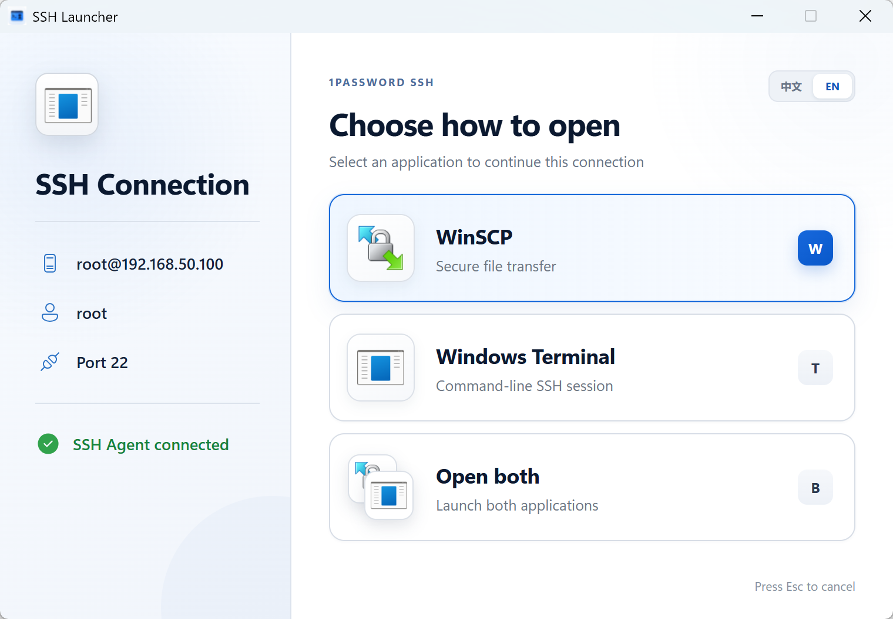

# SSH Launcher

[简体中文](README.zh-CN.md) | English

A lightweight Windows launcher for 1Password SSH Bookmarks. When an `ssh://` link is opened, choose **WinSCP**, **Windows Terminal**, or **both**.

The interface supports English and Simplified Chinese. It follows the system language by default and can be switched manually.

> [!NOTE]
> This is a **vibe coding project**. The author defined the product idea, interaction decisions, and acceptance criteria, while most of the code and visual implementation was iterated in collaboration with AI. Code review, issue reports, and contributions are welcome.

## Screenshot



## Features

- Parses `ssh://` links and displays the host, username, and port
- Opens WinSCP, Windows Terminal, or both
- Keyboard shortcuts: `W`, `T`, and `B`
- Closes automatically after an option is selected
- Keeps the chooser on top until a selection is made
- Finds WinSCP in common installation locations; `winscp.exe` does not need to be in `PATH`
- Reads WinSCP and Windows Terminal icons from locally installed applications at runtime
- English and Simplified Chinese interface
- Portable single-file executable

## Requirements

- Windows 10 or Windows 11
- [1Password 8 for Windows](https://1password.com/downloads/windows/) with SSH Agent enabled
- [WinSCP](https://winscp.net/) **6.6.1 or newer** for file transfer with the 1Password / OpenSSH agent (see below)
- Windows Terminal for terminal SSH sessions
- Windows OpenSSH Client
- Microsoft Edge WebView2 Runtime, normally included with Windows 10/11

> [!IMPORTANT]
> **WinSCP only gained native OpenSSH `ssh-agent` support in [6.6.1 beta](https://winscp.net/eng/docs/history?a=6.6.1)** ([tracker #1682](https://winscp.net/tracker/1682)). Stable releases before that (including the entire 6.5.x line) still talk to **PuTTY Pageant** by default and **cannot** use the 1Password SSH Agent directly. Install WinSCP **6.6.1+** (currently a non-stable / beta channel until it ships in a stable release) and switch the authentication agent as described below.

## Quick start

### 1. Place the executable

Download `SSH-Launcher.exe` and keep it at a stable path, for example:

```text
C:\Tools\SSH-Launcher\SSH-Launcher.exe
```

No installer is required. To move it to another computer, copy the `.exe` and update its path in 1Password on that computer.

### 2. Enable the 1Password SSH Agent

In 1Password for Windows:

1. Open **Settings → Developer**.
2. Enable **Use the SSH Agent**.
3. Make sure the SSH private key for the target server is stored in 1Password.
4. To associate Bookmarks with their selected keys, enable **Generate SSH config files from 1Password SSH bookmarks** in the advanced SSH Agent settings.
5. When 1Password asks you to disable the Windows **OpenSSH Authentication Agent** service, accept it (or stop/disable that service yourself). 1Password then owns the standard Windows agent pipe `\\.\pipe\openssh-ssh-agent`.

Verify the agent is visible to OpenSSH clients:

```powershell
ssh-add -l
```

After approving the 1Password prompt, your keys should be listed.

### 3. Configure WinSCP for the OpenSSH agent (required)

WinSCP defaults to **Pageant**. For 1Password you must use **OpenSSH ssh-agent**.

1. Install [WinSCP 6.6.1 or later](https://winscp.net/eng/download.php) (beta / non-stable is fine until this lands in a stable build). Confirm **Help → About** shows **6.6.1** or higher.
2. Open **Options → Preferences → Security**.
3. Under **Authentication**, set **Authentication agent** to **OpenSSH ssh-agent** (not Pageant).  
   Official docs: [Security preferences](https://winscp.net/eng/docs/ui_pref_security#authentication).
4. For each site (or your default session template), open **Advanced… → SSH → Authentication** and keep **Attempt authentication using agent** enabled (it is on by default).  
   Official docs: [Authentication page](https://winscp.net/eng/docs/ui_login_authentication).
5. Leave **Private key file** empty when keys live only in 1Password (agent-only login).
6. Click **OK**, save the site if needed, then reconnect once to confirm 1Password prompts for approval.

Without step 3, choosing **WinSCP** in this launcher still starts WinSCP, but SFTP login will not use the 1Password agent.

### 4. Configure the SSH URL handler

In **Settings → Developer → SSH Agent → Advanced**:

1. Find **Open SSH URLs with**.
2. Select **Custom terminal command**.
3. Enter the following command, replacing the path with the actual executable location:

```text
"C:\Tools\SSH-Launcher\SSH-Launcher.exe" %s
```

Keep `%s` at the end. 1Password replaces it with the `ssh://` URL.

### 5. Create and open an SSH Bookmark

Create an SSH Bookmark in 1Password. Supported URL examples:

```text
ssh://user@example.com
ssh://user@example.com:2222
ssh://example.com
```

Open the Bookmark and select:

- **WinSCP** for a secure file-transfer session
- **Windows Terminal** for a command-line SSH session
- **Open both** to start both applications

You can also press `W`, `T`, or `B`. SSH Launcher closes automatically after launching the selected application(s).

## WinSCP and the OpenSSH agent

| Topic | Detail |
|-------|--------|
| First version with native OpenSSH agent | **WinSCP 6.6.1 beta** (2026-04-01) |
| Tracker | [#1682 — Support OpenSSH ssh-agent](https://winscp.net/tracker/1682) |
| Changelog | [6.6.1 history](https://winscp.net/eng/docs/history?a=6.6.1): “Support for OpenSSH ssh-agent” |
| Default agent before / without the setting | PuTTY **Pageant** |
| Setting to switch | **Preferences → Security → Authentication agent → OpenSSH ssh-agent** |
| Per-session toggle | **Advanced → SSH → Authentication → Attempt authentication using agent** |
| Why this matters here | 1Password implements the **OpenSSH** agent protocol on Windows, not Pageant |

Older WinSCP builds (before 6.6.1) need a bridge such as [winssh-pageant](https://github.com/ndbeals/winssh-pageant). That is outside the recommended path for this project; upgrade WinSCP instead.

## WinSCP does not need to be in PATH

SSH Launcher searches these locations:

1. System `PATH`
2. The current user's local application directory
3. `Program Files`
4. `Program Files (x86)`

A standard WinSCP installation should work without additional configuration. For a portable/custom WinSCP installation, add its directory to `PATH`.

## Languages

- On first launch, the Windows/WebView language determines whether English or Simplified Chinese is shown.
- Use the **中文 / EN** control in the top-right corner to switch languages.
- The preference is stored locally by WebView. A copied executable follows the language of the destination computer on its first launch.

## Portable migration

The release artifact is a standalone `.exe`. It does not depend on the source folder and does not store private keys.

1. Copy `SSH-Launcher.exe` to the destination computer.
2. Install and sign in to 1Password, WinSCP, and Windows Terminal.
3. Enable the 1Password SSH Agent.
4. Update **Custom terminal command** to the executable's new path.

Private keys remain managed by the 1Password SSH Agent. SSH Launcher never reads or exports them.

## Build from source

Prerequisites:

- Node.js 20+
- Stable Rust with the MSVC toolchain
- Microsoft C++ Build Tools
- WebView2

```powershell
git clone https://github.com/StereoApp/ssh-launcher.git
Set-Location ssh-launcher
npm install
npm run tauri:build
```

The portable executable is produced at:

```text
src-tauri\target\release\ssh-launcher.exe
```

Frontend-only build:

```powershell
npm run build
```

Development mode:

```powershell
npm run tauri:dev
```

## Troubleshooting

### The chooser does not appear

Verify that 1Password uses the full executable path, that the path is inside double quotes, and that `%s` remains at the end.

### WinSCP cannot be found

Install WinSCP with its official installer in the default location. For a portable copy, add the directory containing `WinSCP.exe` to `PATH`.

### WinSCP opens but authentication fails / no 1Password prompt

1. Confirm WinSCP is **6.6.1 or newer** (**Help → About**). Earlier versions do not support the OpenSSH agent natively.
2. Set **Preferences → Security → Authentication agent** to **OpenSSH ssh-agent**.
3. Ensure **Attempt authentication using agent** is enabled for the session.
4. Keep the 1Password SSH Agent enabled, and make sure the Windows **OpenSSH Authentication Agent** service is not occupying the agent pipe.
5. Run `ssh-add -l` in a terminal; if keys do not list there, fix 1Password first before debugging WinSCP.

### Windows Terminal does not open

Confirm that Windows Terminal is installed and launches normally from the Start menu. SSH Launcher tries `wt.exe` first, then common installation locations.

### SSH uses the wrong key

Select the correct SSH Key in the 1Password SSH Bookmark and enable SSH config generation. The generated configuration can be inspected at:

```text
%USERPROFILE%\.ssh\1Password\config
```

### Is the window permanently always-on-top?

Only the chooser stays on top while waiting for a selection. It closes immediately after an option is selected and does not remain in the background.

## Security and privacy

- No telemetry
- No third-party network requests
- No reading, caching, or exporting of SSH private keys
- Credentials are handled by the 1Password SSH Agent and the system SSH client
- Third-party application icons are read from local installations at runtime and are not distributed in this repository

## Trademarks

1Password, WinSCP, Windows, and Windows Terminal are trademarks of their respective owners. This project is not affiliated with, authorized, or endorsed by those owners.

## License

[MIT License](LICENSE)
