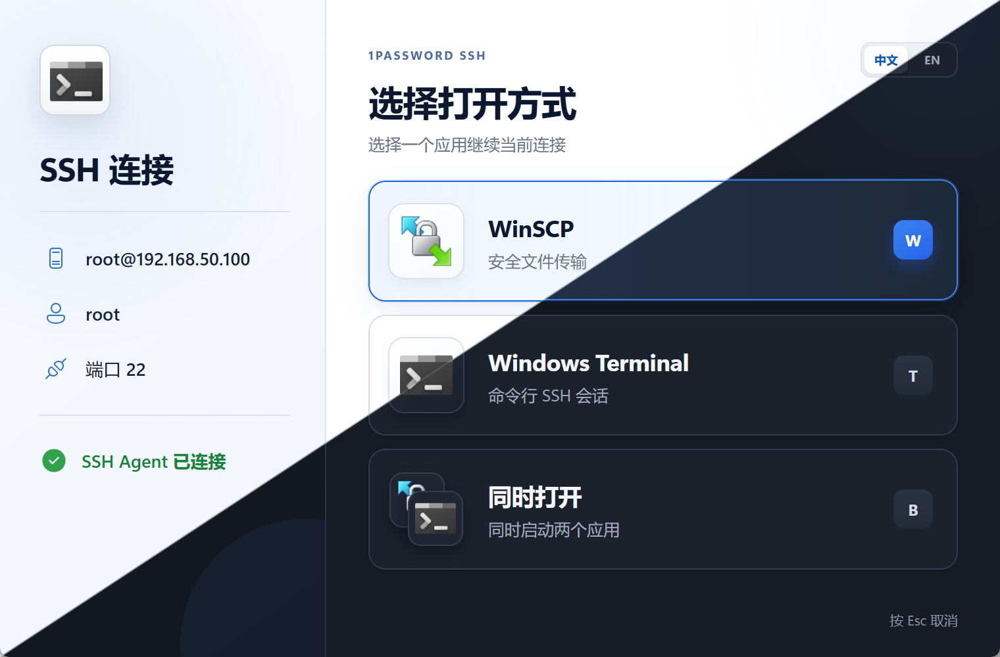

# SSH Launcher

简体中文 | [English](README.md)

一个面向 Windows 的轻量 SSH 启动器。当你从 1Password 打开 SSH Bookmark 时，可以选择 **SFTP GUI**（默认 WinSCP，可选 Cyberduck）、**Windows Terminal**，或**同时打开两者**。

界面提供简体中文和 English，会根据系统语言自动选择，也可以在窗口右上角手动切换。

## 为什么做这个

SSH 密钥都在 **1Password** 里，认证走 SSH Agent 没问题。麻烦的是从 Bookmark 点开时，自定义命令只能绑 **一个** 程序，而我两边都要用：

- 传文件时要 **SFTP GUI**（WinSCP / Cyberduck）  
- 敲命令时要 **终端**  

同一个主机有时还要两个一起开。固定一个入口做不到。

脚本或系统自带对话框功能上也能凑合。还是做成正常 UI，是因为我喜欢 1Password 的界面，不想点完 Bookmark 下一眼就是黑控制台或简陋弹窗。

> [!NOTE]
> 这是一个 **vibe coding 作品**：产品想法、交互取舍与验收由作者完成，代码和视觉实现主要在 AI 协作下迭代完成。欢迎审阅、提出问题和贡献改进。

## 屏幕截图



## 功能

- 接收 `ssh://` 链接并显示主机、用户名和端口
- 一键用 SFTP GUI（WinSCP 或 Cyberduck）、Windows Terminal 或两者同时连接
- 支持快捷键：`W`、`T`、`B`
- 选择打开方式后自动关闭启动器
- 窗口置顶，避免被刚刚打开的应用遮挡
- 自动查找 WinSCP / Cyberduck，无需加入 `PATH`
- 从本机程序文件动态读取应用图标
- 支持简体中文与 English
- 支持浅色 / 深色主题：默认跟随系统，也可通过启动参数指定
- 通过命令行选择 SFTP 客户端（默认 `--sftp=winscp`，或 `--sftp=cyberduck`）
- 单文件便携版，可复制到其他 Windows 电脑使用

## 使用条件

- Windows 10 或 Windows 11
- [1Password 8 for Windows](https://1password.com/downloads/windows/)，并启用 SSH Agent
- [WinSCP](https://winscp.net/) **6.6.1 或更高版本**（默认 SFTP GUI）**或** [Cyberduck](https://cyberduck.io/)（要用 1Password / OpenSSH Agent 做文件传输时，见下文）
- Windows Terminal（需要使用终端 SSH 功能时）
- Windows 自带的 OpenSSH Client
- Microsoft Edge WebView2 Runtime（Windows 10/11 通常已安装）

> [!IMPORTANT]
> **WinSCP 从 [6.6.1 beta](https://winscp.net/eng/docs/history?a=6.6.1) 起才原生支持 OpenSSH `ssh-agent`**（[需求 #1682](https://winscp.net/tracker/1682)）。此前的正式版（含整个 6.5.x 系列）默认只对接 **PuTTY Pageant**，**不能**直接使用 1Password SSH Agent。请安装 **WinSCP 6.6.1+**（在并入正式版之前属于非稳定 / beta 通道），并按下文切换认证代理。

## 快速开始

### 1. 放置程序

下载 `SSH-Launcher.exe`，放到一个长期不变的位置，例如：

```text
C:\Tools\SSH-Launcher\SSH-Launcher.exe
```

程序是便携式的，不需要安装。迁移到另一台电脑时，只需复制这个 `.exe`，然后在那台电脑的 1Password 中重新设置它的新路径。

### 2. 开启 1Password SSH Agent

在 1Password for Windows 中：

1. 打开 **设置（Settings）→ 开发者（Developer）**。
2. 开启 **使用 SSH Agent（Use the SSH Agent）**。
3. 确认需要连接的 SSH 私钥已保存在 1Password 中。
4. 如果希望 Bookmark 自动使用对应密钥，请开启高级选项中的 **Generate SSH config files from 1Password SSH bookmarks**。
5. 若 1Password 提示禁用 Windows 的 **OpenSSH Authentication Agent** 服务，请同意（也可自行在服务里停止/禁用）。之后由 1Password 占用标准管道 `\\.\pipe\openssh-ssh-agent`。

可用下面命令确认 OpenSSH 客户端能看到 Agent：

```powershell
ssh-add -l
```

在 1Password 授权提示通过后，应能列出你的密钥。

### 3. 配置 WinSCP 使用 OpenSSH Agent（必做）

WinSCP 默认使用 **Pageant**。对接 1Password 时必须改为 **OpenSSH ssh-agent**。

1. 安装 [WinSCP 6.6.1 或更高版本](https://winscp.net/eng/download.php)（在功能进入正式版前可使用 beta / 非稳定版）。在 **帮助 → 关于** 中确认版本 ≥ **6.6.1**。
2. 打开 **选项（Options）→ 首选项（Preferences）→ 安全（Security）**。
3. 在 **Authentication（身份验证）** 区域，将 **Authentication agent（身份验证代理）** 设为 **OpenSSH ssh-agent**（不要用 Pageant）。  
   官方说明：[Security preferences](https://winscp.net/eng/docs/ui_pref_security#authentication)。
4. 对每个站点（或默认会话模板），打开 **高级（Advanced…）→ SSH → Authentication**，保持 **Attempt authentication using agent（尝试使用代理进行身份验证）** 为启用（默认已开）。  
   官方说明：[Authentication page](https://winscp.net/eng/docs/ui_login_authentication)。
5. 密钥只放在 1Password 时，**Private key file（私钥文件）** 请留空（纯 Agent 登录）。
6. 确定并保存站点后重新连接一次，确认会出现 1Password 授权提示。

若跳过本步，本启动器仍可打开 WinSCP，但 SFTP 登录不会走 1Password Agent。

### 4. 设置 SSH 链接的打开方式

仍在 1Password 的 **设置 → 开发者 → SSH Agent → 高级（Advanced）** 中：

1. 找到 **Open SSH URLs with**。
2. 选择 **Custom terminal command**。
3. 填入以下命令，并把路径替换为你实际保存的位置：

```text
"C:\Tools\SSH-Launcher\SSH-Launcher.exe" %s
```

必须保留末尾的 `%s`，1Password 会在这里传入 `ssh://` 链接。

若要从 1Password 固定主题，把主题参数写在 `%s` 前面：

```text
"C:\Tools\SSH-Launcher\SSH-Launcher.exe" --theme=dark %s
```

若要用 **Cyberduck** 代替 WinSCP 作为 SFTP 操作（互斥，默认是 WinSCP）：

```text
"C:\Tools\SSH-Launcher\SSH-Launcher.exe" --sftp=cyberduck %s
```

简写：`--cyberduck`。等价写法：`--sftp cyberduck`。

### 5. 创建并打开 SSH Bookmark

在 1Password 中创建 SSH Bookmark，链接可以使用以下格式：

```text
ssh://user@example.com
ssh://user@example.com:2222
ssh://example.com
```

从 Bookmark 点击打开后，SSH Launcher 会显示解析出的连接信息。请选择：

- **WinSCP** 或 **Cyberduck**（由启动参数决定）：打开安全文件传输会话
- **Windows Terminal**：打开命令行 SSH 会话
- **同时打开**：同时启动 SFTP 客户端和 Windows Terminal

也可以直接按 `W`、`T` 或 `B`。选择完成后，SSH Launcher 会自动关闭。

## WinSCP 与 OpenSSH Agent

| 项目 | 说明 |
|------|------|
| 原生支持 OpenSSH Agent 的首个版本 | **WinSCP 6.6.1 beta**（2026-04-01） |
| 需求跟踪 | [#1682 — Support OpenSSH ssh-agent](https://winscp.net/tracker/1682) |
| 更新日志 | [6.6.1 history](https://winscp.net/eng/docs/history?a=6.6.1)：“Support for OpenSSH ssh-agent” |
| 未切换时的默认代理 | PuTTY **Pageant** |
| 切换位置 | **首选项 → 安全 → Authentication agent → OpenSSH ssh-agent** |
| 会话级开关 | **高级 → SSH → Authentication → Attempt authentication using agent** |
| 与本项目的关系 | 1Password 在 Windows 上实现的是 **OpenSSH** Agent 协议，不是 Pageant |

6.6.1 之前的 WinSCP 需要 [winssh-pageant](https://github.com/ndbeals/winssh-pageant) 之类的桥接工具。本项目推荐直接升级 WinSCP，而不是走桥接方案。

## 选择 SFTP 客户端（WinSCP 或 Cyberduck）

第一个操作按钮是唯一的 SFTP GUI。**WinSCP 与 Cyberduck 互斥**，只能通过启动参数选择（应用内无切换开关）。

| 参数 | SFTP GUI |
|------|----------|
| （默认）/ `--sftp=winscp` / `--winscp` | [WinSCP](https://winscp.net/) |
| `--sftp=cyberduck` / `--cyberduck` | [Cyberduck](https://cyberduck.io/) |

示例：

```text
SSH-Launcher.exe "ssh://user@host"
SSH-Launcher.exe --sftp=cyberduck "ssh://user@host"
SSH-Launcher.exe --theme=dark --cyberduck "ssh://user@host"
```

Cyberduck 使用 Windows OpenSSH Agent 管道（与 1Password SSH Agent 兼容），不需要 Pageant 桥接。

## WinSCP / Cyberduck 无需加入 PATH

SSH Launcher 会依次查找系统 `PATH`、当前用户的本地应用目录、`Program Files` 和 `Program Files (x86)`。

使用常规安装方式即可。如果使用自定义绿色版，请把可执行文件所在目录加入系统 `PATH`。

## 多语言

- 首次启动时，根据 Windows/WebView 的语言自动选择简体中文或 English。
- 点击窗口右上角的 **中文 / EN** 可随时切换。
- 语言偏好保存在当前电脑的 WebView 本地存储中；复制程序到另一台电脑后会重新按那台电脑的语言选择。

## 主题

界面支持 **浅色** 与 **深色**。

| 模式 | 行为 |
|------|------|
| **system**（默认） | 跟随 Windows 浅色 / 深色外观 |
| **light** | 始终浅色 |
| **dark** | 始终深色 |

可用启动参数覆盖（与 `ssh://` 链接的先后顺序不限）：

```text
SSH-Launcher.exe --theme=system "ssh://user@host"
SSH-Launcher.exe --theme=light "ssh://user@host"
SSH-Launcher.exe --theme=dark "ssh://user@host"
SSH-Launcher.exe --dark "ssh://user@host"
SSH-Launcher.exe --light "ssh://user@host"
```

也支持：`--theme dark`、`-theme=dark`，以及 `auto` / `default` 作为 `system` 的别名。

浏览器 / Sites 预览：在 URL 后加 `?theme=dark`（或 `light` / `system`）。

## 便携迁移

发布产物是一个独立 `.exe`，不会依赖项目目录，也不会保存私钥。迁移时：

1. 复制 `SSH-Launcher.exe` 到目标电脑。
2. 安装并登录 1Password、WinSCP 和 Windows Terminal。
3. 在目标电脑的 1Password 中启用 SSH Agent。
4. 把 **Custom terminal command** 更新为目标电脑上的新路径。

SSH 私钥始终由 1Password SSH Agent 管理，SSH Launcher 不会读取或导出私钥。

## 从源码构建

需要 Node.js 20+、Rust stable（MSVC toolchain）、Microsoft C++ Build Tools 和 WebView2。

```powershell
git clone https://github.com/StereoApp/ssh-launcher.git
Set-Location ssh-launcher
npm install
npm run tauri:build
```

便携版会生成在：

```text
src-tauri\target\release\ssh-launcher.exe
```

仅构建前端可运行 `npm run build`；开发模式可运行 `npm run tauri:dev`。

## 发版

推送版本 tag 后，GitHub Actions 会构建 Windows 便携版并通过 [GitHub Release](https://github.com/StereoApp/ssh-launcher/releases) 发布。

1. 保持版本号一致：`package.json`、`src-tauri/Cargo.toml`、`src-tauri/tauri.conf.json`。
2. 提交后打 tag 并推送：

```powershell
git tag v1.1.1
git push origin v1.1.1
```

3. **Release** 工作流会生成 `SSH-Launcher.exe` 与 `SHA256SUMS.txt`，并用 `gh release create` 创建发布说明。

也可在 **Actions → Release → Run workflow** 中手动触发：仅构建，或对已有 tag 重新上传产物。

## 常见问题

### 点击 Bookmark 后没有出现窗口

检查 1Password 的自定义命令是否使用了完整路径，路径是否被双引号包裹，以及末尾是否保留 `%s`。

### WinSCP 提示找不到

建议使用 WinSCP 官方安装程序安装到默认目录。绿色版需要把其目录加入系统 `PATH`。

### WinSCP 能打开，但认证失败 / 没有 1Password 授权提示

1. 确认 WinSCP 版本 ≥ **6.6.1**（**帮助 → 关于**）。更早版本不支持原生 OpenSSH Agent。
2. 将 **首选项 → 安全 → Authentication agent** 设为 **OpenSSH ssh-agent**。
3. 确认会话里已启用 **Attempt authentication using agent**。
4. 保持 1Password SSH Agent 开启，并确保 Windows **OpenSSH Authentication Agent** 服务没有占用 Agent 管道。
5. 先在终端运行 `ssh-add -l`；若这里都列不出密钥，先修好 1Password，再排查 WinSCP。

### Windows Terminal 无法打开

确认 Windows Terminal 已安装并且在开始菜单中能够正常启动。应用会优先使用 `wt.exe`，找不到时再尝试系统安装目录。

### SSH 使用了错误的密钥

在 1Password 的 SSH Bookmark 中选择正确的 SSH Key，并开启生成 SSH config 的选项。生成的配置位于：

```text
%USERPROFILE%\.ssh\1Password\config
```

### 窗口会一直置顶吗

启动器窗口本身会置顶，方便你完成选择；点击任意打开方式后它会关闭，不会常驻后台。

## 安全与隐私

- 不收集遥测数据
- 不连接第三方服务
- 不读取、缓存或导出 SSH 私钥
- 连接凭据由 1Password SSH Agent 和系统 SSH 客户端处理
- WinSCP 与 Windows Terminal 图标在运行时从本机安装文件读取，仓库不分发这些第三方品牌资源

## 商标说明

1Password、WinSCP、Windows 和 Windows Terminal 是其各自所有者的商标。本项目与这些产品的所有者没有隶属、授权或背书关系。

## 许可证

[MIT License](LICENSE)
